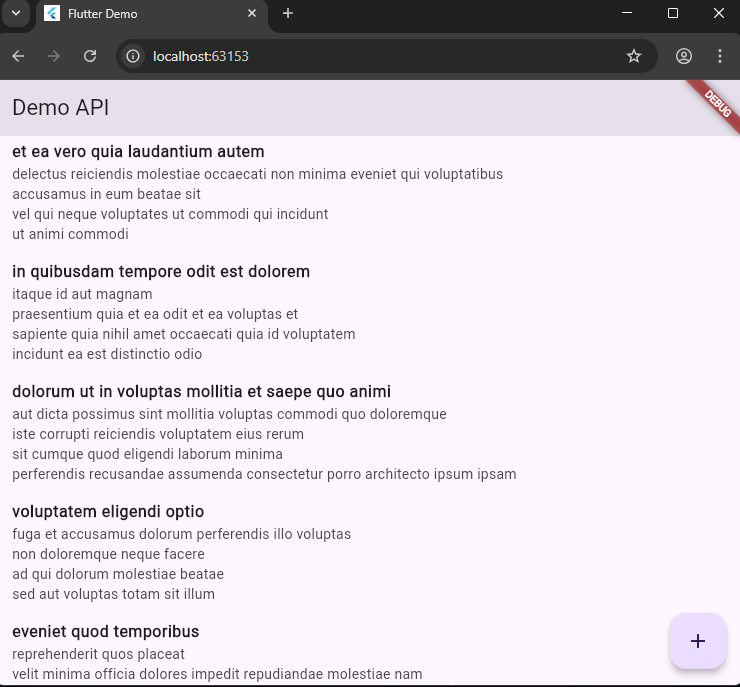

# CSC315 Remote Demo App 🚀

A Flutter application built for **CSC315** that demonstrates consuming a REST API using the **Repository Pattern**. The app fetches data from JSONPlaceholder and displays it in a clean, scrollable list.

## 📱 Screenshots



## ✨ Features

* **GET Request:** Fetches a list of posts from `https://jsonplaceholder.typicode.com/posts`.
* **POST Request:** Includes logic to create new posts via the Repository.
* **Asynchronous UI:** Uses `FutureBuilder` to handle loading states and data display.
* **Clean Architecture:** Separates logic into distinct layers (UI, Data, Logic).

## 🛠️ Project Structure

The project follows a modular structure for better maintainability:


```

lib/
├── main.dart                   # UI Layer (FutureBuilder & ListView)
├── models/
│   └── post.dart               # Data Model (fromJson / toJson)
└── repository/
└── post_repository.dart    # API Logic (http.get / http.post)

```

## 📦 Dependencies

* [http](https://pub.dev/packages/http): ^1.x.x
* flutter/material.dart

## 🚀 How to Run

1.  **Clone the repository:**
    ```bash
    git clone [https://github.com/kem-codes/csc315_remote_demo.git](https://github.com/kem-codes/csc315_remote_demo.git)
    cd csc315_remote_demo
    ```

2.  **Install dependencies:**
    ```bash
    flutter pub get
    ```

3.  **Run the app:**
    (Recommended to run on Chrome if Android emulators are not set up)
    ```bash
    flutter run -d chrome
    ```


